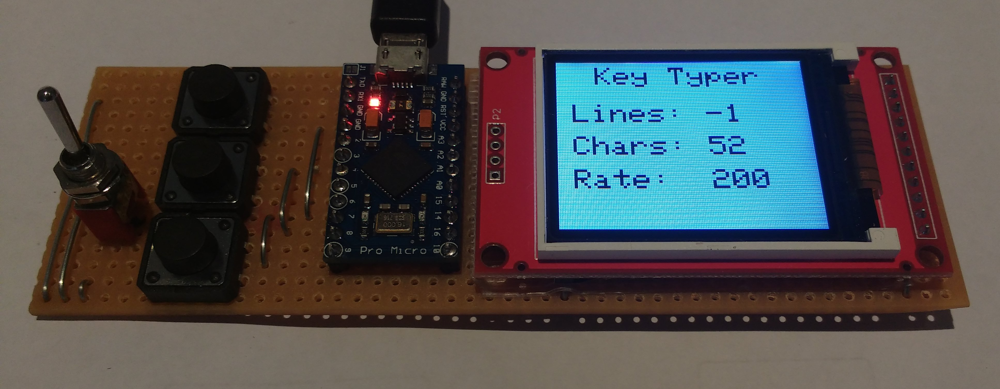
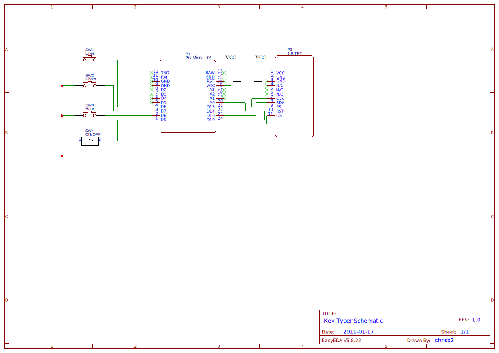

# key-typer
Arduino program for rapidly typing characters using a [Pro Micro - 5V/16MHz](https://www.sparkfun.com/products/12640) as a [USB Human Interface Device](https://en.wikipedia.org/wiki/USB_human_interface_device_class) (HID) keyboard. Based on [Turn your Pro Micro into a USB Keyboard/Mouse](https://www.sparkfun.com/tutorials/337).

I built this to aid in debugging a textarea in a web page which was intermittently dropping characters in IE11 due to a Javascript issue.

There are three adjustable parameters available via the buttons:

- Lines - the number of lines of text to output (-1, 1, 2, 4). The default is -1 (unlimited).
- Characters - the number of characters in each line (5, 13, 26, 52, 104). The default is 26 (a-z).
- Rate - the rate of character generation in characters/minute (100, 200, 400, 1000, 6000). The default is 200 (average typist). 100 is a slow typist, 400 is a professional typist and anything higher is not humanly possible!

These parameters may be adjusted while characters are being generated. Character generation is started and stopped with the toggle switch. A video of the device in action is [here](https://s3-us-west-2.amazonaws.com/public.7777/key-typer-in-action.mp4).

This is the schematic for the project. If the schematic appears to be missing details, download it and view it locally,
or zoom the web page.

