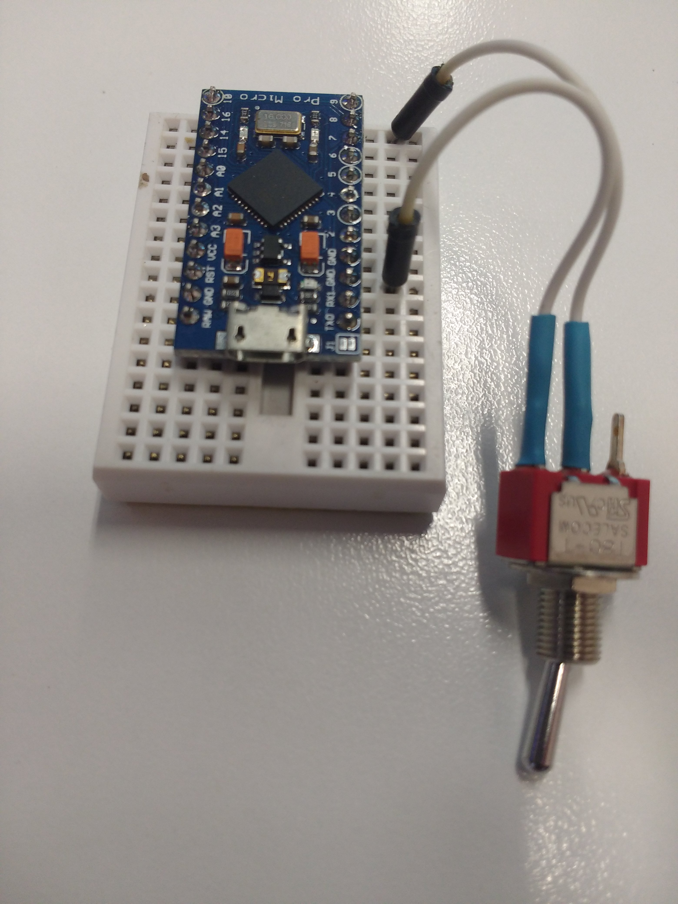

# key-typer

Arduino program for rapidly typing characters using a [Pro Micro - 5V/16MHz](https://www.sparkfun.com/products/12640) as a [USB Human Interface Device](https://en.wikipedia.org/wiki/USB_human_interface_device_class) (HID) keyboard. Based on [Turn your Pro Micro into a USB Keyboard/Mouse](https://www.sparkfun.com/tutorials/337).

I built this to aid in debuging a textarea in a web page which was intermittently dropping characters in IE11 due a Javascript issue.

Use a button or switch between pin 9 and GND on the Pro Micro to trigger character generation.

The two main adjustable constants in the program are:

- DELAY_MS - the delay in milliseconds between each character being sent. Default is 10ms
- LINE_LENGTH - the number of characters in each line. Default is 104 (a-z four times).

